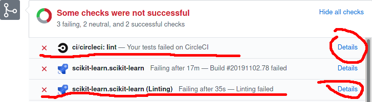
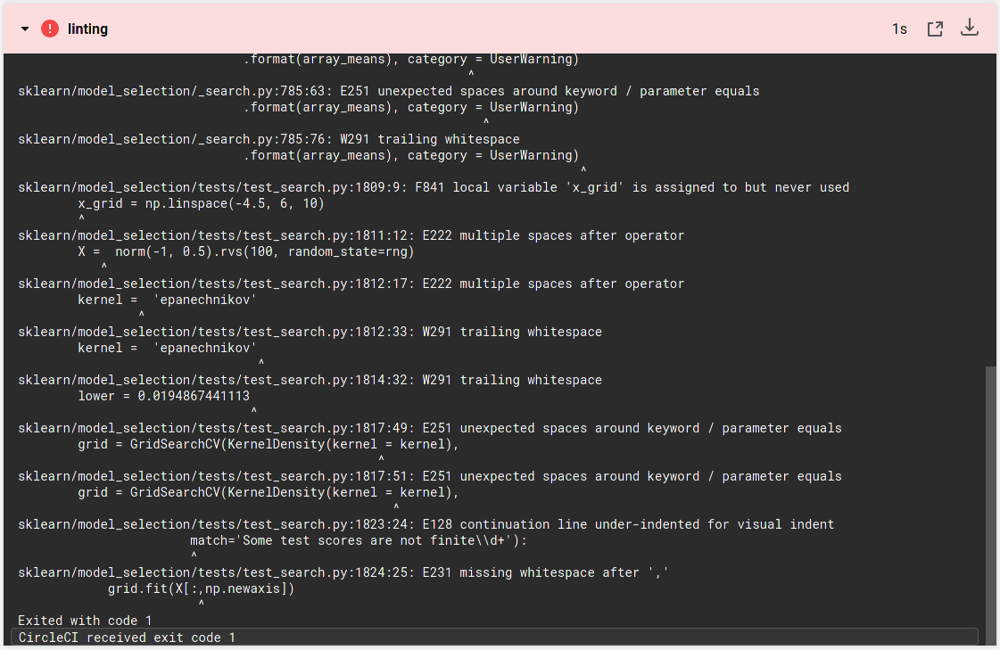
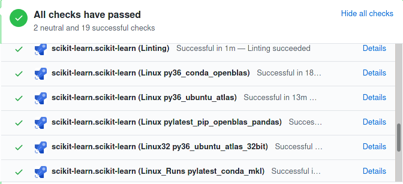

# Continuous Integration

[Continuous integration](https://en.wikipedia.org/wiki/Continuous_integration) (CI) is the process of automating code quality checks during the development process.

The scikit-learn project maintainers use [several CI services](https://scikit-learn.org/stable/developers/contributing.html#continuous-integration-ci) to perform automated quality assurance on the source code and its documentation:
- [Azure pipelines](https://azure.microsoft.com/en-us/services/devops/pipelines/) are used for building and running the scikit-learn test suite using `pytest` on Linux, macOS and Windows against different versions of the dependencies (Python, numpy, scipy...).
- [CircleCI](https://circleci.com/) is used to build the online HTML documentation using `sphinx` (and also to run the tests with PyPy on Linux).

In practice, CI services are notified whenever a commit is pushed to a branch on any Pull Request opened on the main scikit-learn github repo. The results are summarized in the github page of the said Pull Request.


## Lint checks

[Linting](https://en.wikipedia.org/wiki/Lint_(software)) checks are run to analyse whether the lines changed by a given Pull Request introduce any undefined variable, useless import statements or a violation of the PEP8 code style conventions for instance.

`flake8` checks are fast to execute and if the lint fails, most of the longer checks that require building scikit-learn from source are not performed, in order to spare computing resources.

Failing checks are visible at the end of the Pull Request page:



Clicking on the [Details](https://app.circleci.com/pipelines/github/scikit-learn/scikit-learn/jobs/81249) link will expand
the reasons of the failure.

<a href="https://app.circleci.com/pipelines/github/scikit-learn/scikit-learn/jobs/81249" target="_blank">
  
</a>

The log file tells you where the lint issues are: the list of the flake8 errors is available in the flake8
[documentation](https://flake8.pycqa.org/en/latest/user/error-codes.html).

In our case:
- `sklearn/model_selection/_search.py`:785:61: E251 unexpected spaces around keyword / parameter equals, means that
  line 785, column 61 of the file `sklearn/model_selection/_search.py`
  ```
  .format(array_means), category = UserWarning)
  ```
  should become
  ```
  .format(array_means), category=UserWarning)
  ```
- `sklearn/model_selection/_search.py`:785:76: W291 trailing whitespace, means that line 785, column 76 there is a trailing
  space at the end of the line that should be removed.
- `sklearn/model_selection/tests/test_search.py`:1809:9: F841 local variable 'x_grid' is assigned to but never used, means
  that `x-grid` assignement might be removed.
- `sklearn/model_selection/tests/test_search.py`:1812:17: E222 multiple spaces after operator, means that
  ```
  kernel =  'epanechnikov' 
  ```
  should become
  ```
  kernel = 'epanechnikov'
  ```
- `sklearn/model_selection/tests/test_search.py`:1823:24: E128 continuation line under-indented for visual indent, means that
  the code
  ```
  with pytest.warns(UserWarning,
                 match='Some test scores are not finite\\d+'):
  ```
  should become
  ```
  with pytest.warns(UserWarning,
                    match='Some test scores are not finite\\d+'):
  ```
- `sklearn/model_selection/tests/test_search.py`:1824:25: E231 missing whitespace after ',', means that
  ```
  grid.fit(X[:,np.newaxis])
  ```
  should become
  ```
  grid.fit(X[:, np.newaxis])
  ```


To locally check the code you changed, you can run the following command:
``
git diff upstream/main -u -- "*.py" | flake8 --diff
``

## Documentation

A number of checks are performed during the [build of the documentation](https://scikit-learn.org/stable/developers/contributing.html#documentation)


- After the lint (1)
- the documentation build (2) process starts (using `sphinx`).
- The deploy 3) step is meant to deploy the preview of the documentation for visually checking the rendered HTML, including generated png figures.
- The "doc artifact" (4) link list the documentation pages that have been modified by the pull request.

  The last three steps often fail at the same time.
  - If the artifact links are available, failures are probably due to sphinx warnings introduced by changes included in the pull request: see the details by clicking the "doc artifact" link.
  - If artifacts are not available, the build it-self has failed: this can be due, for example, to exceptions in the
    [example scripts](https://github.com/scikit-learn/scikit-learn/tree/main/examples): read the output logs to see the error message and try to reproduce the problem locally.
    Sometimes this is due to CircleCI system failures, typicall a failing network connection (see for example
    [here](https://app.circleci.com/pipelines/github/maikia/scikit-learn/128/workflows/50aac418-6e87-4f10-98e8-4d5c5b5df460/jobs/328/steps)),
    in that case it can be useful to re-trigger the build with an empty commit, with the following commands:
    ```
    $ git commit --allow-empty -m "Trigger CI build."
    $ git push origin <my_branch>
    ```
- The doc-min-dependencies (5) step builds the documentation with minimal versions dependencies.
  A failure at this point means that modifications are not compatible with older versions of Python or of the dependencies
  and some too recent functions should be replaced (see for example [here](https://circleci.com/gh/scikit-learn/scikit-learn/106882?utm_campaign=vcs-integration-link&utm_medium=referral&utm_source=github-build-link)).

The CircleCI configuration files are stored in the [.circleci/](https://github.com/scikit-learn/scikit-learn/tree/main/.circleci) directory, while the build scripts are available under the [build_tools/circleci/](https://github.com/scikit-learn/scikit-learn/tree/main/build_tools/circle) directory.

## scikit-learn building and testing



The Azure checks are defined in the [azure-pipelines.yml](https://github.com/scikit-learn/scikit-learn/blob/main/azure-pipelines.yml).
The Azure configuration files and the build scripts are available under the [build_tools/azure/](https://github.com/scikit-learn/scikit-learn/tree/main/build_tools/azure) directory.
- After the lint (`flake8`) check a number of platforms are tested.
- When the lint is not successful the [pylatest_conda_mkl](https://github.com/scikit-learn/scikit-learn/blob/442abb10ffb54358a750f0f07d983b67d0c73eab/azure-pipelines.yml#L75) is executed anyway. It is the most complete check.
  Not only the library is built and tests are run, but [docstring](https://github.com/scikit-learn/scikit-learn/blob/442abb10ffb54358a750f0f07d983b67d0c73eab/build_tools/azure/posix.yml#L41) are also tested.
- All other platforms are tested only if lint checks has passed: depending on python or libraries versions or architecture
  type some of them might fail while others don't.

## LGTM checks

[LGTM](https://lgtm.com/) is a variant analysis platform that checks your code for Common Vulnerabilities and Exposures
(CVEs). It is performed without actually executing the program and check for bad code practices that could expose the
execution to known bugged behavior.

## CodeCov

[CodeCov](https://codecov.io/) is a tool to check the test coverage of your code.
During the test run on Azure a report is produced and uploaded to codecov.io, containing the analysis about how many lines
of code are not covered by tests.
It is common that if Azure builds not finished yet codecov check result in a failure: this is a temporary failure due to the
fact that the uploaded report is not covering the entire process.
CodeCov failures are relevant only if all the builds are completed. There are two possible reasons to failures:
- current tests did not pass;
- new tests are needed to cover added lines.
